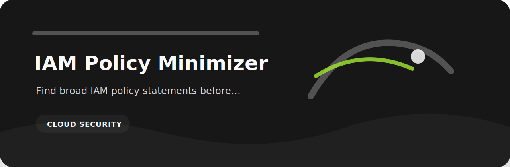
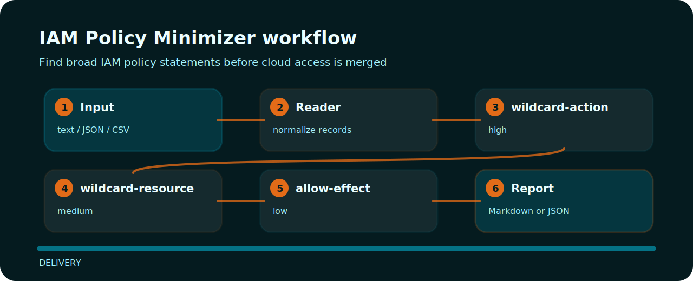

# IAM Policy Minimizer

| Detail | Value |
| --- | --- |
| Area | delivery |
| Entry | `iam-policy-minimizer` |
| Input | plain text |
| Output | terminal findings, optional JSON |



## Use it when

This repository turns a tiny plain text into reviewable signals for cloud security.

## Finding map



## Signals

- `wildcard-action` - wildcard action detected (high); replace with explicit actions.
- `wildcard-resource` - wildcard resource detected (medium); scope resources tightly.
- `allow-effect` - allow statement present (low); verify this allow is required.

## Try the fixture

```bash
git clone https://github.com/mertefekurt/iam-policy-minimizer.git
cd iam-policy-minimizer
python -m pip install -e ".[dev]"
iam-policy-minimizer examples/sample.txt
```
